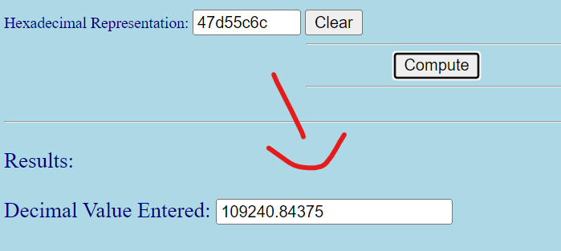

# Linear Regression on FPGA — Report

**Formula:**  
$$ Y = X \cdot \beta + \epsilon, \quad \beta = (X^T X)^{-1} X^T Y $$

---

## Introduction

This project implements **linear regression** on an FPGA (Xilinx).  
Everything from scratch, starting from:

- Random dataset generation in Python  
- Conversion to binary/hex for BRAM initialization  
- Rewriting the algorithm in a **hardware-friendly** way (no functions, no libraries)  
- Visualizing and drafting the design **on paper first**  
- Implementing XtX and XtY computation in Verilog  
- Verifying results against Python golden model  
- Running synthesis and analyzing FPGA resource utilization  

⚠️ **Limitation:** Stopped at **matrix inversion** in Verilog due to time constraints. Completing inversion is left as **future work**.

---

## Step 1: Data Generation

Datasets (`X`, `Y`) were generated in Python using a fixed random seed.  
- Converted into **single precision (32-bit IEEE 754)** floating point.  
- Saved serially into files, later converted into `.coe` for BRAM initialization.  
- HxD was used to open binary dumps and export contents into `.coe` format.  

The process is fully captured in the notebooks:  
- `random_dataset_xygenerator_to_binary.ipynb`  
- `hw_friendly_linear_regression.ipynb`  

---

## Step 2: XtX and XtY in Verilog

- The Verilog code is a **1-to-1 translation of ASM charts** drawn earlier.  
- Floating-point adders/multipliers from Xilinx IP are used as combinational circuits.  
- FSM states were expanded to handle **pipeline delays** (FP ops split into multiple states).  
- BRAM read/write cycles were considered.  

**Files:**  
- `linear_regression.v`  
- `linear_regression_test_bench.v`  

---

## Step 3: Verification

Simulation results for XtX and XtY matched Python exactly.  
- Each FPGA Dout (output) was compared against golden model values.  
- Verified entries include:  
  - XtY[2], XtY[5], XtY[10]  
  - XtX[23], XtX[45], XtX[120]  

Below are **sample figures** extracted from the original report:

---

## Step 4: Synthesis Report

Notes: The frequency might be low, but we used the **minimum number of resources**.  

- Cycle time: 10 ns  
- Simulation time: 1,032,310 ns (~1.03 ms)  

**Resource usage:**  
- Adders/Subtractors: 8  
- Counters: 2  
- Registers (FFs): 162  
- Multiplexers: 65  
- FSMs: 1  

**Timing Summary:**  
- Minimum period: 16.394 ns (Max Frequency ~ 60.9 MHz)  
- Minimum input arrival time before clock: 1.220 ns  
- Maximum output required time after clock: 0.753 ns  

**Device Utilization:**  
- Slice Registers: 210 / 126800 (0%)  
- Slice LUTs: 758 / 63400 (1%)  
- Block RAM/FIFO: 6 / 135 (4%)  
- DSP48E1: 5 / 240 (2%)  

(See `synthesis_report.md` for the full synthesis log.)

---

## Results

- XtX and XtY implemented and validated.  
- Outputs identical to Python golden model.  
- Minimal hardware resource usage.  
- Stable simulation and synthesis.  

---

## Limitations and Future Work

- Matrix inversion **not implemented** (needed for β calculation).  
- Future work:  
  - Add matrix inversion in Verilog.  
  - Explore pipelined architectures.  
  - Extend to multivariable regression.  
  - Compare fixed-point vs floating-point tradeoffs.  

---

## Design Diagrams

Hand-drawn ASM charts and datapath designs are included in:  
- `design_diagrams.md`  
- `design_diagram_images/`  

---

## Conclusion

Demonstrated FPGA-based linear regression up to XtX and XtY computation.  
With further development (matrix inversion), the design can be completed and extended.

---

## References

- Python notebooks (data generation, algorithm prep).  
- Xilinx module documentation.  
- Hand-drawn design diagrams.  
- Original simulation screenshots (above).  
